# composiciones-equipo
## Composiciones de ALL IN

Utiles por su potencial de ganar TF's cuando se esta en desventaja. Y para toda jugada se debe mover en equipo; torres, dragones o baron, todos juntos.

### Requerimientos:

* A lo menos 1 iniciador,
* Todos los personajes de la composicion deben tener daño en area,
* 1 personaje con daño DPS para limpiar tras las TF's y
* Iniciar las TF's.

### Ventajas:

* Fácil de utilizar y
* No depende de un buen early

### Desventaja:

* Dependencia de las ultimates, por lo que no se puede iniciar una TF si no alguno de los jugadores no cuenta con la suya y
* No son útiles en desventaja numérica.

### Relación con otras composiciones:

* Fuertes contra:
    + Split Push
    + Pokeo
* Débiles contra:
    + Cazar al Enemigo
    + Proteger al Carry

### Ejemplos de composiciones:

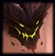 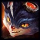 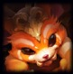 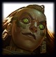 

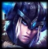 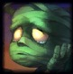 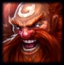 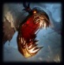

 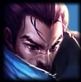  

 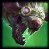 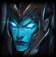 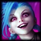

   

## Composiciones de Proteger al Carry

Se trata de tener 1 o 2 hiper-carrys con gran dps en el equipo, y el resto del equipo debe pickear personajes para protegerlos.

### Requerimientos:
* 1 o 2 Hyper-carrys con escalado al late,
* Herramientas de disengage utilizadas en los HC,
* Todo personaje que no sea el HC, debe tener habilidades de utilidad,
* El HC debe resistir todo el daño enemigo, todos los demas personajes son sacrificios y
* Peleas de equipo 5v5 manteniendo vivo al HC

### Ventajas:

* No depende de ganar líneas, ya que el late tiene más impacto y
* Consta de composiciones seguras y dificiles de jugar en contra.

### Desventajas:
* Dependen de la supervivencia de los HC y de morir este, la pelea se pierde.

### relación con otras composiciones:

* Fuertes contra:
    + All In
    + Cazar al Enemigo
* Débiles contra:
    + Pokeo
    + Split Push

### Ejemplos de composiciones:

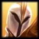 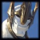 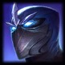

 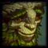 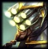

  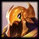

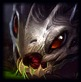  

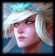  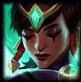

## Composiciones de Cazar al Enemigo

Utilizada para cazar enemigos que esten separados de sus aliados. Se aprovecha con equipos con muchos errores de posicionamiento.
Se busca generar la posibilidad de una TF con ventaja numérica.

### Requerimientos:

* Todos los carrys deben tener daño en rafaga, para matar a 1 enemigo rapidamente,
* Se debe tener mucho control de masa individual,
* Mucha movilidad para mantener un control de la visión y
* Se debe forzar al enemigo a cometer un fail check.

### Ventajas:

* Castiga el error enemigo.

### Desventajas:

* Mala composicion para generar peleas 5V5 (No se debe nunca forzar peleas).

### relación con otras composiciones:

* Fuertes contra:
    + All In
    + Split Push
* Débiles contra:
    + Pokeo
    + Proteger al Carry

### Ejemplos de composiciones:

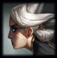 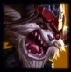 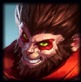 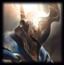 

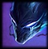 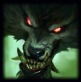 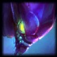 

 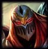 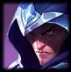 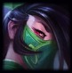 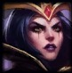

   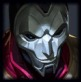

 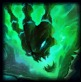 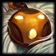 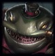

## Composiciones de Pokeo

Excelente capacidad para negar objetivos al enemigo ya sea logrando matarlos o dejandolos bajos de vida, forzando el recall a base.

### Requerimientos:

* Todos los pick, a excepsion de 1 deben tener habilidades de largo alcance y bajo CD,
* Los picks deben tener herramientas para hacre daño a las torres,
* La excepción debe contar con un disengage fuerte y
* Pokear enemigos durante largos periodos de tiempo.

### Ventajas:

* La composicion mas seguro que existe por la distancia desde donde se ejecutan los ataques,
* Dominio del early y
* Gran control de objetivos.

### Desventajas:
* La composición mas difícil de jugar,
* Débil frente a engage fuertes (ej: Malphite) y
* Débil contra composiciones con mucho sustane (Soraka o Vladimir).

### Relación con otras composiciones:

* Fuertes contra:
    + Proteger al Carry
    + Cazar al Enemigo
* Débiles contra:
    + All In
    + Split Push

### Ejemplos de composiciones:

 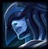 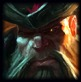  

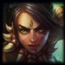  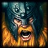 

 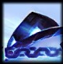 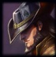 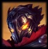 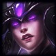

  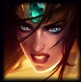 

   

## Composiciones de Split Push

Se basan en evitar combates con el enemigo, dedicarse a empujar las lineas individualmente y generar duelos 1v1.

### Requerimientos:

* Picks dedicados a duelear,
* Picks con mucha movilidad,
* Capacidad para limpiar oleadas de minions,
* No buscar peleas, esperar la distraccion enemiga y enviar 1 o 2 personas a pushear lineas distintas y
* Separar al enemigo forzando que deban ir a las lineas que estan siendo pusheadas.

### Ventajas:
* Todos los pick pueden ganar sus duelos en fase de líneas y
* Ejerce presión en el mapa.

### Desventajas:
* Pesima composicion para las TF's, de entrar a una lo mas probable es que la pierdan y
* Si el enemigo se organiza, pueden ser facilmente contrarestadas.

### Relación con otras composiciones:

* Fuertes contra:
    + Proteger al Carry
    + Pokeo
* Débiles contra:
    + All In
    + Cazar al Enemigo

### Ejemplos de composiciones:

 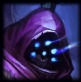 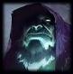 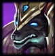 

 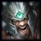 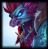 

   

   

   