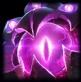
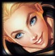
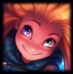
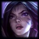
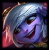

# Guía de Metodología de juego para League of Legends

**Índice**
1. [Guía de composiciones de equipos](#id1)
    1. [Composiciones de All In](#id11)
    2. [Composiciones de Proteger al Carry](#id12)
    3. [Composiciones de Cazar al Enemigo](#id13)
    4. [Composiciones de Pokeo](#id14)
    5. [Composiciones de Split Push](#id15)
2. [Guía de MacroGame](#id2)
3. [Guía de MicroGame](#id3)
4. [Guía de Top](#id4)
5. [Guía de Jg](#id5)
6. [Guía de Mid](#id6)
7. [Guía de Adc](#id7)
8. [Guía de Supp](#id8)

## Guía de composiciones de equipos
[Volver al índice](#id)

Seleccion de campeones durante la fase de pick's. Estrategia que se utiliza para maximizar la capacidad de control de mapa y objetivos del mapa al equipo enemigo.

### Composiciones de All In
[Volver al índice](#id)

Utiles por su potencial de ganar TF's cuando se esta en desventaja. Y para toda jugada se debe mover en equipo; torres, dragones o baron, todos juntos.

#### Requerimientos:

* A lo menos 1 iniciador,
* Todos los personajes de la composicion deben tener daño en area,
* 1 personaje con daño DPS para limpiar tras las TF's y
* Iniciar las TF's.

#### Ventajas:

* Fácil de utilizar y
* No depende de un buen early

#### Desventaja:

* Dependencia de las ultimates, por lo que no se puede iniciar una TF si no alguno de los jugadores no cuenta con la suya y
* No son útiles en desventaja numérica.

#### Relación con otras composiciones:

* Fuertes contra:
    + Split Push
    + Pokeo
* Débiles contra:
    + Cazar al Enemigo
    + Proteger al Carry

#### Ejemplos de composiciones:

    

   

   

   

   

### Composiciones de Proteger al Carry
[Volver al índice](#id)

Se trata de tener 1 o 2 hiper-carrys con gran dps en el equipo, y el resto del equipo debe pickear personajes para protegerlos.

#### Requerimientos:
* 1 o 2 Hyper-carrys con escalado al late,
* Herramientas de disengage utilizadas en los HC,
* Todo personaje que no sea el HC, debe tener habilidades de utilidad,
* El HC debe resistir todo el daño enemigo, todos los demas personajes son sacrificios y
* Peleas de equipo 5v5 manteniendo vivo al HC

#### Ventajas:

* No depende de ganar líneas, ya que el late tiene más impacto y
* Consta de composiciones seguras y dificiles de jugar en contra.

#### Desventajas:
* Dependen de la supervivencia de los HC y de morir este, la pelea se pierde.

#### relación con otras composiciones:

* Fuertes contra:
    + All In
    + Cazar al Enemigo
* Débiles contra:
    + Pokeo
    + Split Push

#### Ejemplos de composiciones:

  

  

  

  

  

### Composiciones de Cazar al Enemigo
[Volver al índice](#id)

Utilizada para cazar enemigos que esten separados de sus aliados. Se aprovecha con equipos con muchos errores de posicionamiento.
Se busca generar la posibilidad de una TF con ventaja numérica.

#### Requerimientos:

* Todos los carrys deben tener daño en rafaga, para matar a 1 enemigo rapidamente,
* Se debe tener mucho control de masa individual,
* Mucha movilidad para mantener un control de la visión y
* Se debe forzar al enemigo a cometer un fail check.

#### Ventajas:

* Castiga el error enemigo.

#### Desventajas:

* Mala composicion para generar peleas 5V5 (No se debe nunca forzar peleas).

#### Relación con otras composiciones:

* Fuertes contra:
    + All In
    + Split Push
* Débiles contra:
    + Pokeo
    + Proteger al Carry

#### Ejemplos de composiciones:

    

   

    

   

   

### Composiciones de Pokeo
[Volver al índice](#id)

Excelente capacidad para negar objetivos al enemigo ya sea logrando matarlos o dejandolos bajos de vida, forzando el recall a base.

#### Requerimientos:

* Todos los pick, a excepsion de 1 deben tener habilidades de largo alcance y bajo CD,
* Los picks deben tener herramientas para hacre daño a las torres,
* La excepción debe contar con un disengage fuerte y
* Pokear enemigos durante largos periodos de tiempo.

#### Ventajas:

* La composicion mas seguro que existe por la distancia desde donde se ejecutan los ataques,
* Dominio del early y
* Gran control de objetivos.

#### Desventajas:
* La composición más difícil de jugar,
* Débil frente a engage fuertes (ej: Malphite) y
* Débil contra composiciones con mucho sustane (Soraka o Vladimir).

#### Relación con otras composiciones:

* Fuertes contra:
    + Proteger al Carry
    + Cazar al Enemigo
* Débiles contra:
    + All In
    + Split Push

#### Ejemplos de composiciones:

    

   

    

   

   

### Composiciones de Split Push
[Volver al índice](#id)

Se basan en evitar combates con el enemigo, dedicarse a empujar las lineas individualmente y generar duelos 1v1.

#### Requerimientos:

* Picks dedicados a duelear,
* Picks con mucha movilidad,
* Capacidad para limpiar oleadas de minions,
* No buscar peleas, esperar la distraccion enemiga y enviar 1 o 2 personas a pushear lineas distintas y
* Separar al enemigo forzando que deban ir a las lineas que estan siendo pusheadas.

#### Ventajas:
* Todos los pick pueden ganar sus duelos en fase de líneas y
* Ejerce presión en el mapa.

#### Desventajas:
* Pesima composicion para las TF's, de entrar a una lo mas probable es que la pierdan y
* Si el enemigo se organiza, pueden ser facilmente contrarestadas.

#### Relación con otras composiciones:

* Fuertes contra:
    + Proteger al Carry
    + Pokeo
* Débiles contra:
    + All In
    + Cazar al Enemigo

#### Ejemplos de composiciones:

    

   

   

   

   

## Guía de MacroGame
[Volver al índice](#id)

Es la estrategia que se utiliza durante la partida para maximizar los recursos y ganancias con el minimo riesgo posible.

Esto es fundamental, ya que LoL es un juego de economía.

### Prioridades de línea

Se define como la toma de decisiones y ejecucion de acciones que generar un reaccion en el contrario.

#### Se logra cuando

* Se puede pushear la línea más rápido que el contrario,
* Se tienen más kill potetial,
* Mejor posicionamiento,
* Ventaja de summoners o
* Cualquier condición propia que fuerce al enemigo a responder.

Las prioridades de linea se buscan dependiendo de la Win-condiion que se tiene.

### Win-condition

Es el planteamiento de composicion en contra de la composicion oponente. Esto se puede medir con; 
* Momentos de picos de poder: ventaja de nivel o items contra el enemigo,
* Cuando puedes tradear daño: ventaja de vida, cantidad de aliados, un gankeo o un enemigo con vida extremadamente baja,
* Cuando puedes matar: Tienes todas tus habilidades disponibles, tus summoners o con respaldo aliado en un 2v1,
* Cuando puedes pushear: Los enemigos estan concentrados en cazar a un aliado, en un objetivo o estan todos en una sola linea (en este caso el 131 siempre es lo mejor),
* Pick con Win-condition: Aliados con altas probabilidades de realziar una jugada que da ventaja al equipo, 
* Posicionamiento en el mapa: El equipo debe tomar posicionamientos para cada jugada, para tf's o para realizar objetivos,
* Base de juego: Si se esta jugando a obtener objetivos, escalar en nivel o oro, cerrar el juego tempranamente o retrasarlo.

### Nivel 1

#### Invade

Solo se debe realizar un invade cuando el pico de poder en nivel 1 aliado sea mejor que el enemigo.

Equipo con cc inicial vs uno solo con daño

Ejemplo:

### Early game

Etapa del juego temprano, la que depende de los 3 terminos anteriores.

La Win-condition del early depende de tu prioridad de linea, y como planteaste la composicion de nivel 1.

Lo normal es que el early dure hasta el min 10, en terminos de nivel. Y es cuando el jg debe aprovechar la realizacion de gankeos para dar ventajas a los picks de mid game.

### Transición

Es la etapa previa al mid game. Se trata de ir por la primera torreta, para posteriormente romper el primer anillo de torretas.

Esto se puede lograr con picks orientados al split-push, o por la rotacion de un enemigo.

Tras romper la primera torre, se procede a tomar un heraldo si esta disponible, con este romper la segunda. Pushear las lineas con las torres destruidas y ir por la que faltaba. Con esto se logra dar transicion al mid-game.

### Mid game

La actividad en el juego medio dependera de la composicion de equipo.

#### En estanco

Para aquellas composiciones con picos de poder atrasados o que llegan tarde en la partida. Por lo que se busca ser eficiente en el escalado de oro y experiencia.

#### Por objetivos

Para aquellas composiciones de early y mid game, lo mejor es forzar objetivos para adquirir recursos que ayuden a finiquitar la partida lo antes posible.

La partida no debe durar más de 30 minutos.

Ejemplo:

# Guía de MicroGame
[Volver al índice](#id)

# Guía de Top
[Volver al índice](#id)

# Guía de Jg
[Volver al índice](#id)

# Guía de Mid
[Volver al índice](#id)

# Guía de Adc
[Volver al índice](#id)

# Guía de Supp
[Volver al índice](#id)